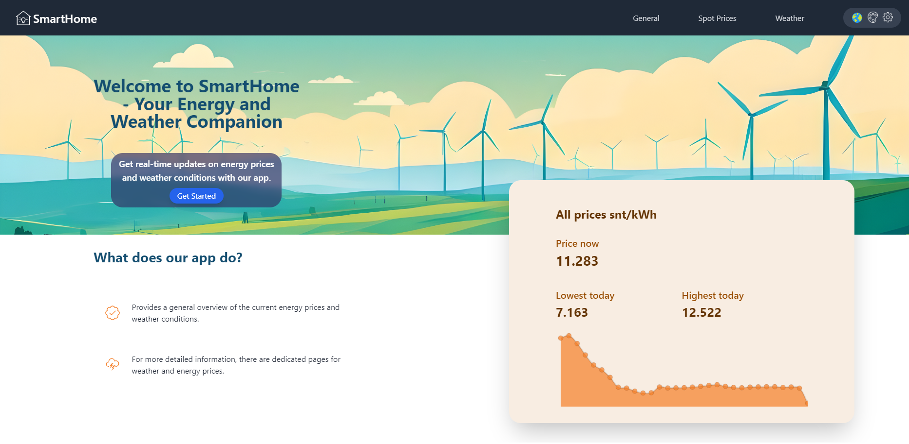
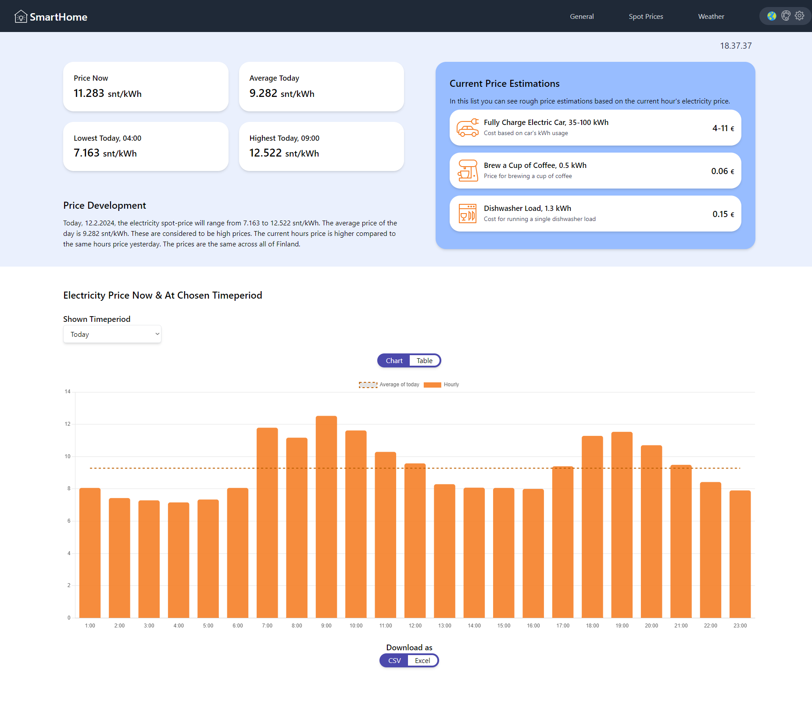
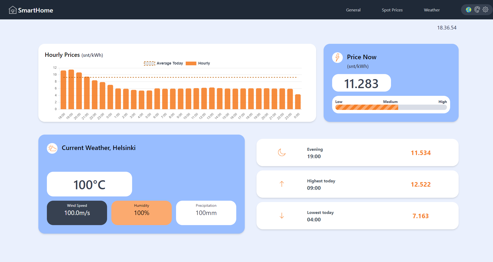
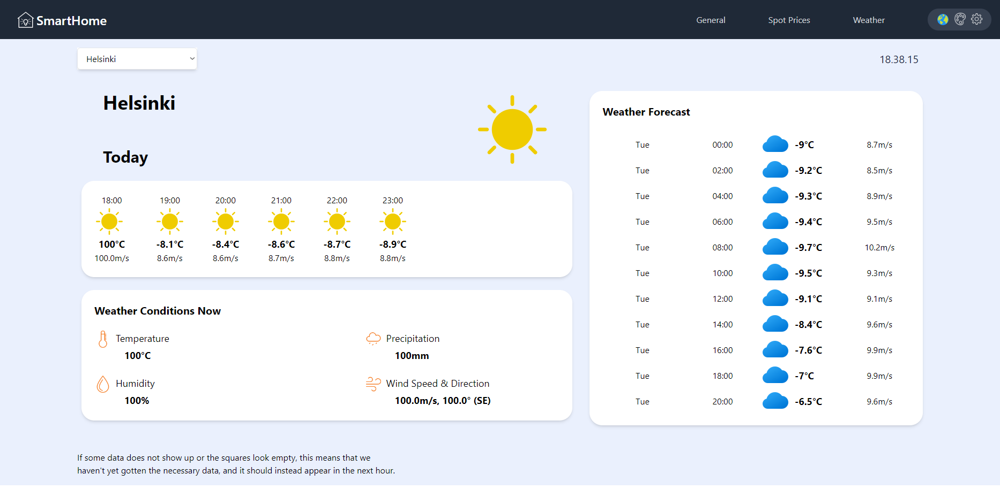

## SmartHome ⚡
Projekti, jossa luodaan web-sivusto sähkön spot-hinnan **Node.js**:in avulla, sekä sää datan näyttämiseen. Sivusto kerää sää **(Ilmatieteen Laitos)**- ja sähkön hintatietoja **(Pörssisähkö.net)** julkisista lähteistä API- kutsujen avulla ja tallentaa saamansa tiedot tietokantaan **(PostgreSQL)** myöhempää analyysia varten.

